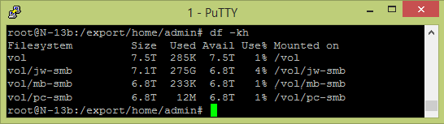

## 7TB in DC!

von gRoot

am 2015-02-13

in Server

hooray! Our new server is installed in the datacenter- best regards to [speedbone](https://www.speedbone.de/) support.

1xGb/s & 100Mb/s Links are online and disks are getting hot (..yes, yes dc has air conditioning 😉 )

tag datacenter server speedbone