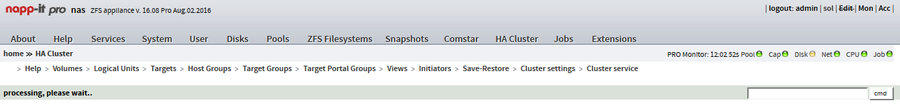

## napp-it supports HA Cluster RFS-1

von gRoot

am 2016-09-05

in IT-Services, Server

RFS-1, a provider for ZFS-HA (good known and experienced with HA-Cluster nexentastor), supports OmniOS and other ZFS derivatives.



Now napp-it can manage the RFS-1 High Availability-Cluster Plugin.

Offical announcement @napp-it website:

```
napp-it 16.08 pro edition
 Appliance security supports RSF-1 ports 1195 and 8020
 Comstar: create and delete raw LU
 new main menu HA Cluster with RSF-1 cluster settrings
  napp-it Pro: Support for RSF-1 Cluster
```

Link to napp-it [changelog](http://www.napp-it.org/downloads/changelog_en.html)

tag cluster HA High-Availability Napp-it nexentastor OmniOS ZFS