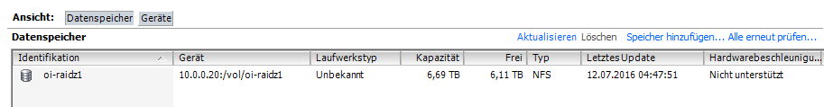

## OmniOS is a burnig flame

von gRoot

am 2016-05-17

in IT-Services, Server

OmniOS is a greate operating system. Illumos based (like nexentastor 😉 ) and free.

ZFS and KVM inside and easy to use. But how should i use it?

In my case OmniOS is my SDS OS for my ESXi Enviroment 😉

tag ESXi Illumos KVM nexenta nexentastor nfs OmniOS SDS server ZFS zpool