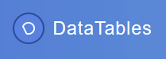

## Wir haben DataTables entdeckt

von gRoot

am 2018-10-25

in IT-Services, Entwicklung



Wir wollten eine einfache schlanke Lösung um tabellarisch Informationen anzuzeigen.

Uns wurde https://datatables.net/ empfohlen. Wie setzen wir es ein?

Im Frontend reicht eine generische View. Einzelnen Views werden nur über eine einzelne .js Datei und den entsprechenden Backen-Endpoint definiert.

Wie sieht die generische View aus in einer Joomla componenten aus?

```
<?php

defined('_JEXEC') or die();

$application = JFactory::getApplication();
$document = JFactory::getDocument();

$document->addScript("https://cdn.datatables.net/v/dt/jszip-2.5.0/dt-1.10.18/b-1.5.6/b-colvis-1.5.6/b-html5-1.5.6/b-print-1.5.6/sl-1.3.0/datatables.min.js");
$document->addStyleSheet("https://cdn.datatables.net/v/dt/jszip-2.5.0/dt-1.10.18/b-1.5.6/b-colvis-1.5.6/b-html5-1.5.6/b-print-1.5.6/sl-1.3.0/datatables.min.css");

if (isset($this->scriptfilename)) {
    $document->addScript(JURI::base().'components/com_js/assets/js/'.$this->scriptfilename.'.js');
}

if (isset($this->title)) {echo "<h2>".$this->title."</h2>";}
?>

<table cellpadding="0" cellspacing="0" border="0" dataid="<?php echo $this->dataid; ?>" class="display mydatatable" id="<?php echo $this->scriptfilename; ?>" width="100%">
</table>

...
```

Die muss mir dem Parameter: "scriptfilename" und ggf. dem "title" definiert werden. "dataid" ist ein Parameter mit dem wir ggf. im .js weiterarbeiten können.

Das entsprechende .js mit der DataTables definition wird über "addScript" geladen.

tag DataTables javascript joomla php