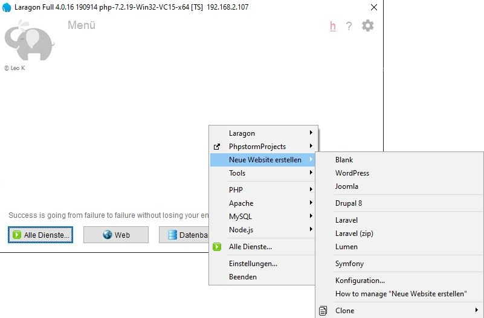
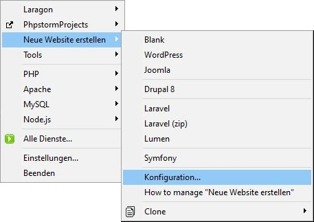

## Der Kampf um die DEV begonnen hat ... Laragon

von gRoot

am 2020-05-04

in IT-Services, Server, Entwicklung

Laragon = WAMP + Composer + GIT + Framework/CMS Support ...

Natürlich mögen wir Vagrant Homestead oder eine schöne Docker Instance, vieleicht auch eine VM oder einen Rootserver.

Laragon hat trotzdem seine Vorteile, Es ist eine ["Turnkey"-Solution](https://de.wikipedia.org/wiki/Turnkey-L%C3%B6sung) und das erleichtert das Deployment immens.

Ich brauche schnell eine lokale Joomla Instanz um ein Plugin oder eine Componente zu testen? Ist das WordPress Backup lauffähig? Dann schnell mal ein lokales WP aufsetzen. Ich will entwickeln und brauche eine Lumen oder Laravel basis.





Die einzelnen "Muster" für das automatische Deployment werden über die "Konfiguration" eingestellt.

Die sites.conf sieht wie folgt aus:

```
...
# WordPress
WordPress=https://wordpress.org/latest.tar.gz
# Joomla
Joomla=https://github.com/joomla/joomla-cms/releases/download/3.9.8/Joomla_3.9.8-Stable-Full_Package.tar.gz
...
# Laravel
Laravel=composer create-project laravel/laravel %s --prefer-dist
Laravel (zip)=https://github.com/leokhoa/quick-create-laravel/releases/download/5.6.21/laravel-5.6.21.7z
Lumen=composer create-project laravel/lumen  %s --prefer-dist
...
```

Die automatischen vhost sind nützlich. HeidiSQL, Composer, GIT gehören immer dazu und sind dabei.

In Verbindung mit JetBrains IDE Tools z.B. PhpStorm kann man schnell eingene Anwendungen entwickeln.

tag composer git HeidiSQL homestead jetbrains laragon laravel lumen PhpStorm vagrant wamp