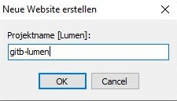
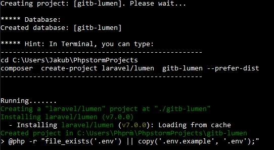
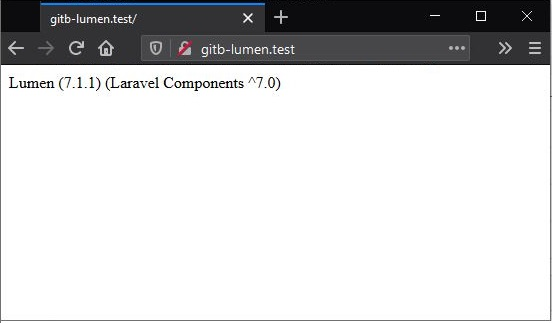

## Laragon - Lumen

von gRoot

am 2020-05-12

in IT-Services, Server, Entwicklung

Wir erstellen ein Laravel Lumen Projekt, "gitb-lumen" genannt. Öffen Laragon, starten die Dienste und "Neue Webseite erstellen" => "Lumen".

Nach einer weile (Installing.....) haben wir dann eine frische Laravel Lumen Umgebung.

tag laragon laravel lumen