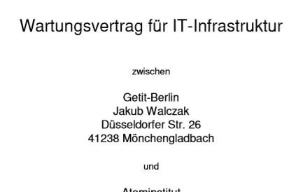

## Neuer Wartungsvertrag ... es gibt immer was zu tun

von gRoot

am 2020-04-23

in IT-Services

Erreichbarkeit, Wiederherstellungszeit, Reaktionszeit, Updates, Aktualisierungen, ...

> Die einzige Konstante im Leben ist die Veränderung
>
> — Heraklit

Ob die eigenen Website, Software oder die eigenen IT-Systeme, alles verändert sich; Zu wissen das sich darum jemand zuverlässig kümmert sorgt für entspannten Schlaf, snooozzzz***

tag Getit-Berlin SLA Wartungsvertrag