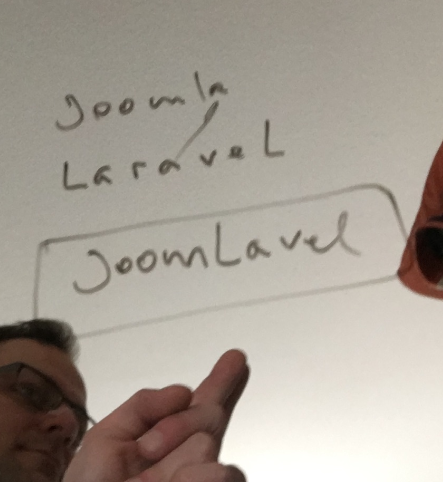

## We have a baby, we have called it: JoomLavel,

von gRoot

am 2020-08-31

in IT-Services, Entwicklung

In the last 2 years we have worked in complicated Joomla CMS project. The project has grown and we hit joomla limitations.

How to leave a [vendor-lockin](https://en.wikipedia.org/wiki/Vendor_lock-in) and joomla limitations? A REST API might be the solution. The [Separation_of_concerns](https://en.wikipedia.org/wiki/Separation_of_concerns) principle describes a seperation of a computer program in distinct sections.

JoomLavel allows you to use a modern laravel API backend in combination with your own joomla application. You can easily add functionalities in the laravel api to enchance joomla functionalities without changing the joomla framework code or joomla components or plugins.

Checkout our Github documentation page:

https://github.com/JoomLavel/documentation

More informations will be published the next days:

tag git Github joomla joomlavel laravel php REST