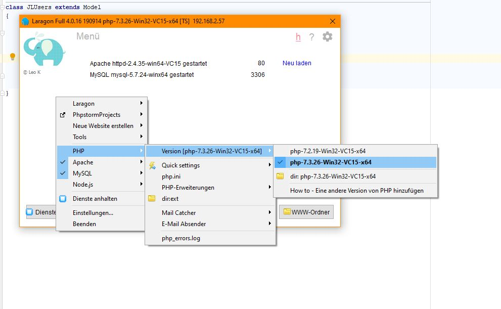

## PHP Update unter Laragon

von gRoot

am 2021-01-15

in IT-Services

Je nachdem wann man Laragon heruntergeladen und installiert hat, mag es sein, dass man einen alte PHP Version hat.

Das merkt man dann, wenn Composer einem bei:

```
composer update
```

einen Fehler zurück gibt.

Wie macht man das nun bei Laragon? Wie aktualisiert man nun die PHP Version?

"Rechtsklick" unter Laragon und dann in das Verzeichnis wechseln



Von https://windows.php.net/download/ die entsprechenden Version runterladen und diese in dem Verzeichnis entpacken.

Diese Version dann im Laragon Kontextmenü auswählen und Laragon Dienste restarten. 🥳 Fertig!

tag composer laragon php