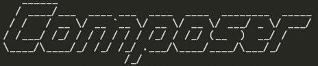

## Manual PHP composer install

von gRoot

am 2023-02-01

in DevOps

Php composer ist für zeitgemäße Php Entwicklung essentiell.



Wie installiert man nun Php composer? Unter https://getcomposer.org/ findet man heraus wie.

Hier ist auch ein Code Schnipsel dazu:

```
php -r "copy('https://getcomposer.org/installer', 'composer-setup.php');"
php -r "if (hash_file('sha384', 'composer-setup.php') === '756890a4488ce9024fc62c56153228907f1545c228516cbf63f885e036d37e9a59d27d63f46af1d4d07ee0f76181c7d3') { echo 'Installer verified'; } else { echo 'Installer corrupt'; unlink('composer-setup.php'); } echo PHP_EOL;"
php composer-setup.php
php -r "unlink('composer-setup.php');"

sudo mv composer.phar /usr/local/bin/composer
```

Php Composer (nicht docker composer 😅