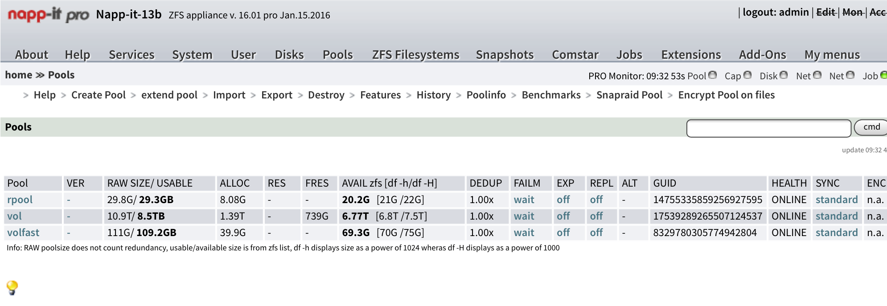

## Koorperation mit napp-it

von gRoot

am 2016-08-25

in IT-Services, Server

Wir kooperieren mit Napp-it! *freu* :D

Aus Schwäbisch Gmünd hat ein geniales Produkt die ZFS Welt aufgerüttelt. Das Management eines ZFS Storage Servers wird extrem vereinfacht und hebt die gesamte Storage Lösung auf eine neue Ebene.

Wir sind jetzt auf der napp-it Seite im Bereich Consulting [gelistet](https://napp-it.org/distribution/consulting.html) und wollen Napp-it, OmniOS und uns dieses Jahr mit einer Kampagne vorwärts bringen!

https://napp-it.org/distribution/consulting.html

tag consulting Napp-it OmniOS Software defined Storage ZFS