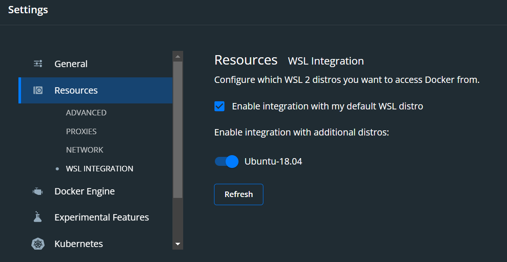

## Docker Desktop und WSL2

von gRoot

am 2021-09-01

in IT-Services, Entwicklung, DevOps

Um WSL 2 in einer Docker Desktop Umgebung unter Windows zu nutzen bedarf es ein wenig Konfiguration.

```
wsl.exe -l -v
wsl.exe --set-default-version 2
```

In den Eigenschaften des Docker Desktops kann man die Distribution unter Settings -> Resources -> WSL Integration einstellen.

Ich empfehle Ubuntu 🥳



tag docker Docker Desktop